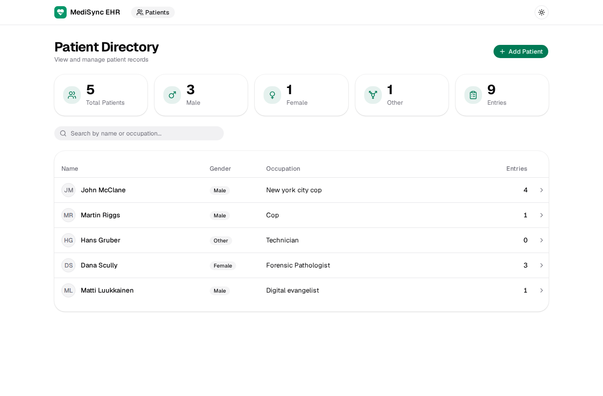
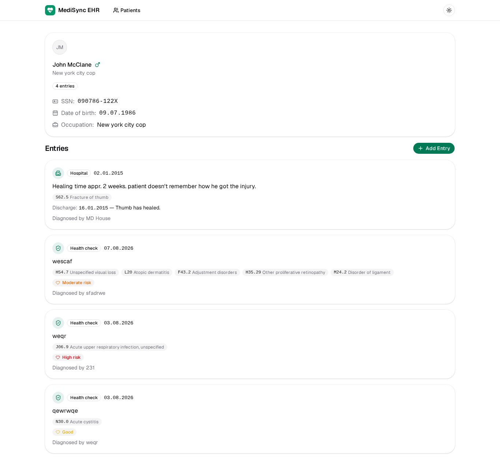
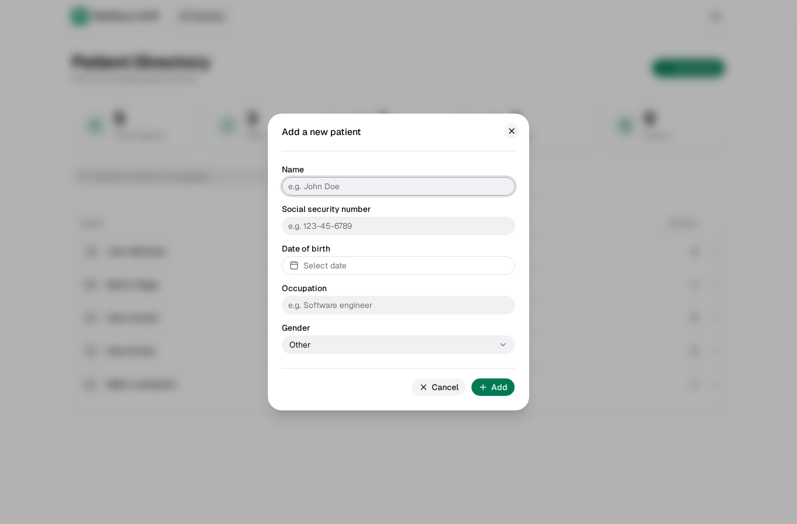
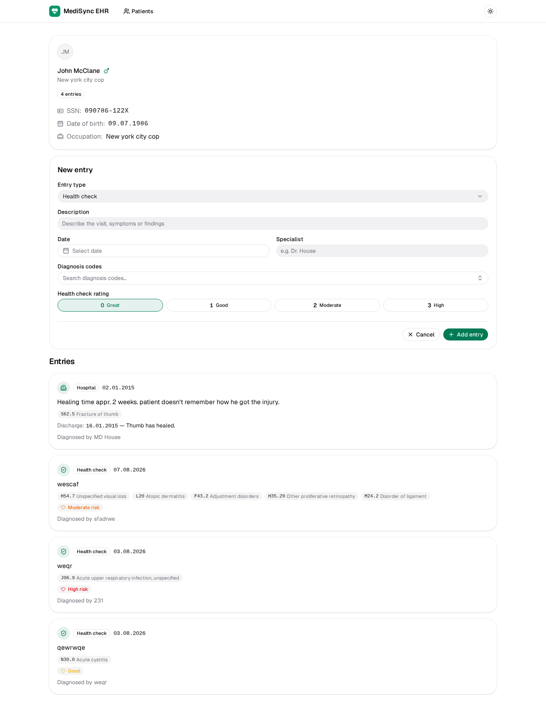

# MediSync EHR

A full-stack, **end-to-end type-safe** electronic health record system for managing patient directories and structured medical histories. The frontend is a React + Vite + shadcn/ui SPA, the backend a layered Express + Zod API, both written in strict TypeScript and containerized with Docker.

[](https://www.typescriptlang.org/)
[](https://react.dev/)
[](https://vite.dev/)
[](https://tailwindcss.com/)
[](https://ui.shadcn.com/)
[](https://expressjs.com/)
[](https://zod.dev/)
[](https://www.docker.com/)
[](https://pnpm.io/)

---

## Highlights

- **Patient directory** with live statistics, instant search by name or occupation, avatar initials, gender badges, and clickable rows that navigate to a full record.
- **Typed medical entries** covering three specializations — **Health Check**, **Hospital**, and **Occupational Healthcare** — each validated as a Zod *discriminated union* and rendered with its own specialized UI.
- **Searchable diagnosis codes**: a combobox backed by an ICD-10-style code list (`S62.5`, `J10.1`, ...) supporting multi-select with removable tag pills.
- **Precise data typography**: SSNs, dates, and diagnosis codes render in monospace with tabular numerals so dense medical identifiers stay scannable next to body text.
- **Calendar-first inputs**: every date field (birth date, entry date, discharge, sick-leave range) uses a proper calendar picker instead of free-text.
- **Feedback everywhere**: skeleton loaders while fetching, a designed empty state, and success/error toasts for every mutation — no guessing whether an action worked.
- **Light / dark / system** theme toggle with a Flash-of-Wrong-Theme prevention script and a custom flat brand mark used across favicon and header.

## Why it's built this way

- **End-to-end type safety.** The domain model (`Patient`, `Entry`, `Diagnosis`, `Gender`) is expressed once as strict TypeScript and mirrored across client and server. A malformed payload cannot silently survive the boundary.
- **Validation at the edge.** All inbound data is parsed by **Zod** schemas before it touches business logic; entry types are validated as a discriminated union, and exhaustive rendering on the client is guaranteed with an `assertNever` helper — adding a new entry type produces compile errors everywhere it must be handled.
- **Layered backend.** Routes stay thin; business logic and data access live in services; seed data lives in a dedicated module. Swapping the in-memory store for a real database changes one file, not the API surface.
- **Componentized UI.** A curated shadcn/ui + Radix primitive layer sits under feature components, giving consistent, accessible markup with almost no bespoke CSS.
- **Reproducible tooling.** pnpm with a frozen lockfile, multi-stage production images, and a dedicated dev Compose stack with Vite HMR behind an nginx reverse proxy.

## Tech stack

| Layer       | Choice                                                                                |
| ----------- | ------------------------------------------------------------------------------------- |
| Frontend    | React 18, TypeScript, Vite, Tailwind CSS v4, shadcn/ui (radix-rhea preset), Radix UI   |
| State & UI  | React Router, lucide-react icons, next-themes, sonner toasts                          |
| Forms       | react-day-picker, date-fns, cmdk combobox                                              |
| Backend     | Node.js, Express 5, TypeScript, Zod 4, uuid                                            |
| Infra       | Docker, docker compose, nginx reverse proxy, pnpm                                      |

## Project structure

```text
medisync-ehr/
├── frontend/                 # React SPA (Vite + Tailwind v4 + shadcn/ui)
│   ├── src/
│   │   ├── components/       # Pages, forms, and shadcn/ui primitives
│   │   ├── services/         # Typed Axios API clients
│   │   ├── utility/          # Formatting, error mapping, health-rating meta
│   │   └── types.ts          # Domain types shared with the API contract
├── backend/                  # Express 5 REST API
│   ├── src/
│   │   ├── routes/           # HTTP transport layer
│   │   ├── services/         # Business logic and data access
│   │   ├── data/             # Seeded in-memory data (patients, diagnoses)
│   │   ├── utils.ts          # Zod schemas and request validators
│   │   └── types.ts          # Domain types and enums
├── nginx.conf                # Production reverse proxy (:8080)
├── nginx.dev.conf            # Dev proxy with Vite HMR upgrade headers
├── docker-compose.yml        # Production-like compose stack
└── docker-compose.dev.yml    # Development compose stack (hot reload)
```

## Screenshots

|                                Directory                                 |                               Patient details                               |                               Add patient                               |                              Add entry                              |
| :----------------------------------------------------------------------: | :-------------------------------------------------------------------------: | :---------------------------------------------------------------------: | :-----------------------------------------------------------------: |
|  |  |  |  |

## Getting started

### Option 1 — Docker (production-like)

```bash
docker compose up --build
```

Open <http://localhost:8080> — nginx serves the static frontend and proxies `/api` to the backend.

### Option 2 — Docker (development, hot reload)

```bash
docker compose -f docker-compose.dev.yml up --build
```

Same entry point (<http://localhost:8080>), but the frontend runs the Vite dev server with HMR and the backend restarts on changes.

### Option 3 — Local (pnpm)

Backend (defaults to `http://localhost:3001`):

```bash
cd backend
pnpm install
pnpm dev
```

Frontend (defaults to the backend above):

```bash
cd frontend
pnpm install
pnpm dev
```

Open <http://localhost:5173>. If your backend runs elsewhere, set `VITE_API_BASE_URL` (e.g. `.env.local`):

```bash
VITE_API_BASE_URL=http://localhost:3001/api
```

> Requires pnpm. If you don't have it, run `corepack enable` first.

## API

| Method | Endpoint                  | Description                                          |
| ------ | ------------------------- | ---------------------------------------------------- |
| GET    | `/api/ping`               | Health check                                         |
| GET    | `/api/diagnoses`          | All diagnosis codes                                  |
| GET    | `/api/patients`           | Non-sensitive patient list (SSN stripped)            |
| GET    | `/api/patients/:id`       | Full patient record, including entries               |
| POST   | `/api/patients`           | Create a patient (Zod-validated)                     |
| POST   | `/api/patients/:id/entries` | Append a typed entry (discriminated-union validated) |

Every `POST` body is validated server-side with Zod; malformed payloads return structured `400` errors instead of reaching the data layer.

## Scripts

| Package  | Script     | Description                                          |
| -------- | ---------- | ---------------------------------------------------- |
| backend  | `pnpm dev` | Run with ts-node-dev (auto-restart on change)        |
| backend  | `pnpm build` | Compile strict TypeScript to `build/`              |
| backend  | `pnpm start` | Run the compiled server                             |
| backend  | `pnpm lint` | ESLint (flat config)                                |
| frontend | `pnpm dev` | Vite dev server with HMR                             |
| frontend | `pnpm build` | `tsc --noEmit` + production build                   |
| frontend | `pnpm lint` | ESLint with unused-disable reporting                |
| frontend | `pnpm preview` | Preview the production build                       |

## Environment variables

| Variable            | Scope    | Default                        |
| ------------------- | -------- | ------------------------------ |
| `PORT`              | backend  | `3001`                         |
| `VITE_API_BASE_URL` | frontend | `http://localhost:3001/api`    |

## What's next

- Automated tests: unit + integration suites for the Zod schemas and services, component tests with Testing Library.
- Persistent storage: replace the seeded in-memory repository with PostgreSQL.
- Real authentication and role-based access control for clinicians.
- FHIR-aligned export for interoperability with hospital systems.

---

Originally built as a _Full Stack Open_ course project, then rewritten into this production-style architecture. By [Mahmud Hossain Sushmoy](https://github.com/moysush) · [github.com/moysush/medisync-ehr](https://github.com/moysush/medisync-ehr)
