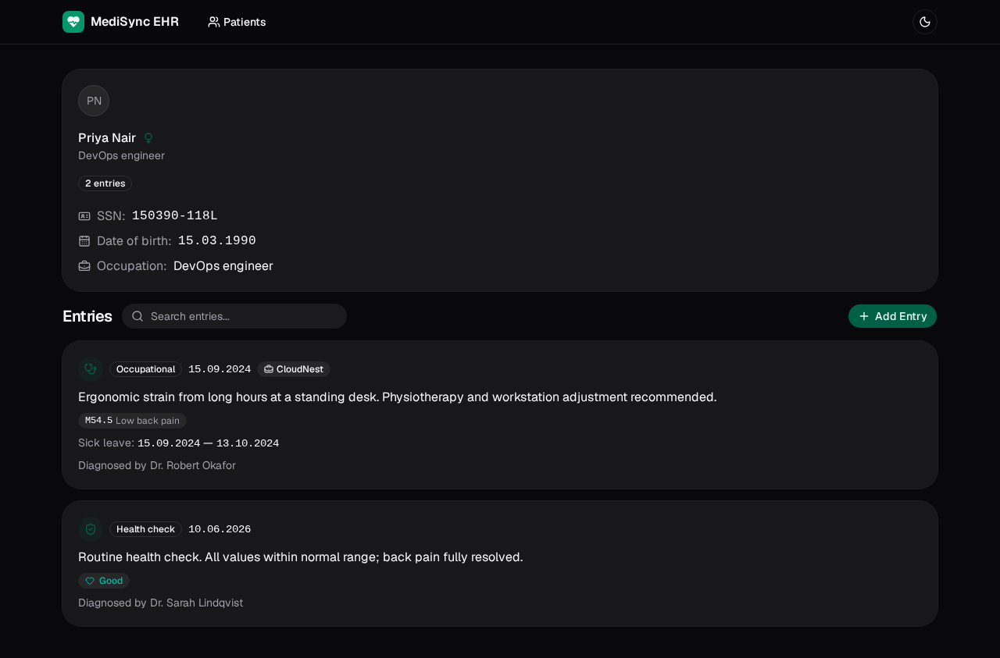
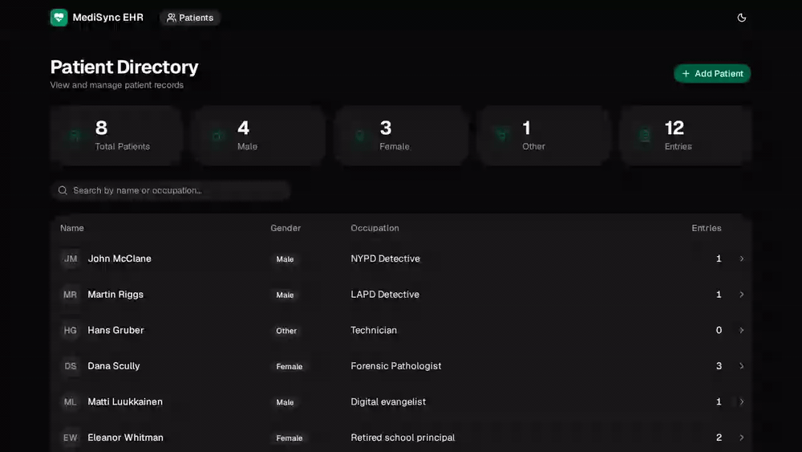

# MediSync EHR

An end-to-end type-safe electronic health record for managing patient directories and structured medical histories. React + Vite + shadcn/ui on the front, Express + Zod on the back, strict TypeScript throughout, containerized with Docker.

[](https://www.typescriptlang.org/)
[](https://react.dev/)
[](https://vite.dev/)
[](https://tailwindcss.com/)
[](https://ui.shadcn.com/)
[](https://expressjs.com/)
[](https://zod.dev/)
[](https://www.docker.com/)
[](https://pnpm.io/)

<p align="center">
  <a href="https://medisync-ehr.vercel.app/">
    
  </a>
</p>

<p align="center">
  
  <br /><em>Patient record — typed medical entries with monospace identifiers and coded diagnoses</em>
</p>

<p align="center">
  
  <br /><em>In action — search, record view, and a calendar entry that closes on selection</em>
</p>

## Features

- **Patient directory** — live statistics, instant search by name or occupation, and one click to a full record.
- **Typed medical entries** — Health Check, Hospital, and Occupational Healthcare, validated as a Zod *discriminated union* and rendered with type-specific UIs.
- **Searchable diagnosis codes** — an ICD-10-style combobox with multi-select and removable tag pills.
- **Calendar-first inputs** — every date field uses a calendar picker that closes on selection.
- **Scannable identifiers** — SSNs, dates, and diagnosis codes in monospace with tabular numerals.
- **Feedback everywhere** — skeleton loaders, designed empty states, and success/error toasts on every mutation.
- **Light / dark / system** theming, applied without a flash of the wrong theme.

## Architecture

Three parts behind a single nginx entry point:

```
             :8080 (same-origin)
Browser ───────────────► nginx
                          │  /api   │  /
                          ▼         ▼
                     Express + Zod   static SPA
                     (:3001)         (try_files → /index.html)
```

- **Typed contract.** `Patient`, `Entry`, and `Diagnosis` are defined once and mirrored across client and server, so a malformed payload cannot survive the boundary.
- **Validation at the edge.** Zod parses every request body before it reaches business logic; entry types are validated as a discriminated union. Unknown routes return JSON `404`s, and unexpected errors collapse to a single JSON `500`.
- **Layered backend.** Routes stay thin; business logic lives in services; seed data sits in a dedicated module — swapping the in-memory store for a database changes the data layer, not the API surface.
- **Exhaustive rendering.** An `assertNever` helper turns "add a new entry type" into compile errors everywhere it must be handled.
- **Lean containers.** The backend runtime is Alpine + Node at ~136MB (was ~410MB) via multi-stage builds, and nginx serves the frontend with SPA history fallback so deep links survive a refresh.

## Tech stack

| Layer       | Choice                                                                        |
| ----------- | ----------------------------------------------------------------------------- |
| Frontend    | React 18, TypeScript, Vite, Tailwind CSS v4, shadcn/ui (radix-rhea), Radix UI |
| State & UI  | React Router, lucide-react, next-themes, sonner                                |
| Forms       | react-day-picker, date-fns, cmdk combobox                                      |
| Backend     | Node.js, Express 5, TypeScript, Zod 4, uuid                                    |
| Infra       | Docker, docker compose, nginx, pnpm                                            |

## Project structure

```text
medisync-ehr/
├── frontend/                 # React SPA
│   ├── Dockerfile            # Multi-stage build, served by nginx
│   ├── nginx.conf            # Static-serving config with SPA fallback
│   └── src/
│       ├── components/       # Pages, forms, shadcn/ui primitives
│       ├── services/         # Typed Axios API clients
│       ├── utility/          # Formatting, error mapping, rating meta
│       └── types.ts          # Domain types shared with the API contract
├── backend/                  # Express 5 REST API
│   ├── Dockerfile            # Multi-stage build → ~136MB runtime
│   ├── requests/             # .rest files for API exploration
│   └── src/
│       ├── index.ts          # App bootstrap, 404 + error middleware
│       ├── routes/           # HTTP transport layer
│       ├── services/         # Business logic and data access
│       ├── data/             # Seeded in-memory store
│       ├── utils.ts          # Zod schemas and request validators
│       └── types.ts          # Domain types and enums
├── nginx.conf                # Production reverse proxy (:8080)
├── nginx.dev.conf            # Dev proxy with Vite HMR upgrade headers
├── docker-compose.yml        # Production-like stack
└── docker-compose.dev.yml    # Development stack (hot reload)
```

## Getting started

Requires pnpm (`corepack enable` if missing). Both packages pin pnpm via the `packageManager` field (pnpm@11.20.0), so corepack resolves the same version on any machine.

### Docker — production-like

```bash
docker compose up --build
```

Open <http://localhost:8080>. nginx serves the static frontend and proxies `/api` to the backend.

### Docker — development (hot reload)

```bash
docker compose -f docker-compose.dev.yml up --build
```

Same entry point, but the frontend runs the Vite dev server and the backend restarts on change.

### Local (pnpm)

```bash
cd backend && pnpm install && pnpm dev    # API on :3001
cd frontend && pnpm install && pnpm dev   # SPA on :5173
```

The frontend calls the API through a same-origin `/api` path — Vite proxies it to `:3001` in dev, nginx in Docker. To point elsewhere:

```bash
echo "VITE_API_BASE_URL=https://api.example.com/api" > frontend/.env.local
```

## API

| Method | Endpoint                    | Description                              |
| ------ | --------------------------- | ---------------------------------------- |
| GET    | `/api/ping`                 | Health check                             |
| GET    | `/api/diagnoses`            | All diagnosis codes                      |
| GET    | `/api/patients`             | Patient list (SSN stripped)              |
| GET    | `/api/patients/:id`         | Full record incl. entries — `404` if unknown |
| POST   | `/api/patients`             | Create a patient (Zod-validated)         |
| POST   | `/api/patients/:id/entries` | Append a typed entry — `404` if unknown  |

Request bodies are validated server-side; malformed payloads return structured `400` errors instead of reaching the data layer.

## Scripts

| Package  | Script      | Description                                   |
| -------- | ----------- | --------------------------------------------- |
| backend  | `pnpm dev`  | Run with ts-node-dev (auto-restart)           |
| backend  | `pnpm build`| Compile TypeScript to `build/`                |
| backend  | `pnpm start`| Run the compiled server                       |
| backend  | `pnpm lint` | ESLint (flat config)                          |
| frontend | `pnpm dev`  | Vite dev server with HMR                      |
| frontend | `pnpm build`| Type-check + production build                 |
| frontend | `pnpm lint` | ESLint with unused-disable reporting          |
| frontend | `pnpm preview` | Preview the production build              |

## Environment variables

| Variable            | Scope    | Default                          |
| ------------------- | -------- | -------------------------------- |
| `PORT`              | backend  | `3001`                           |
| `VITE_API_BASE_URL` | frontend | `/api` (proxied by Vite/nginx)   |

## Roadmap

- Automated tests — unit and integration suites for the Zod schemas and services, component tests with Testing Library.
- Persistent storage — replace the seeded in-memory store with PostgreSQL.
- Authentication and role-based access control for clinicians.
- FHIR-aligned export for interoperability.

---

Originally built as a _Full Stack Open_ course project, then rewritten into this production-style architecture. By [Mahmud Hossain Sushmoy](https://github.com/moysush) · [github.com/moysush/medisync-ehr](https://github.com/moysush/medisync-ehr)
